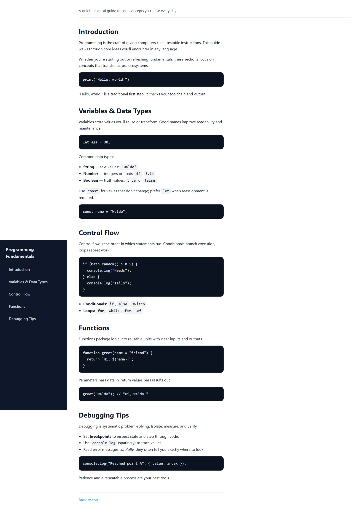

Programming Fundamentals — Tech Docs

A lightweight, professional technical documentation page built with semantic HTML and modern, accessible CSS. It presents core programming concepts—variables, control flow, functions, and debugging—in a clean, responsive layout with a sticky sidebar that adapts to mobile.

✨ Features

Semantic structure with clear headings and landmark roles

Accessible navigation (keyboard-friendly, skip link, focus states)

Sticky sidebar → topbar on small screens

Readable code samples using <pre><code> and high-contrast styling

CSS custom properties for easy theming and brand tweaks

Smooth scrolling and pleasant anchor offsets

No dependencies (pure HTML/CSS)
